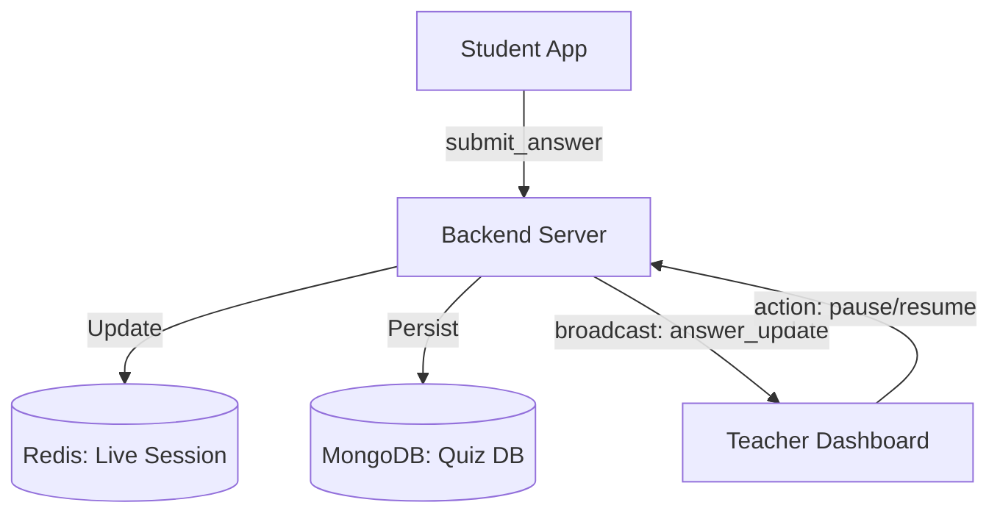

# Real-time Quiz Monitoring API Specification

This document outlines the architecture and data requirements for implementing real-time quiz monitoring using **Node.js**, **Socket.IO**, **Redis**, and **MongoDB**.

## 1. High-Level Architecture



---

## 2. Data Storage Strategy

### A. MongoDB (Persistent Storage)
Used for configuration and permanent records.
- **Quizzes Collection**: Metadata, questions, correct answers.
- **Submissions Collection**: Final results after quiz completion.

### B. Redis (Real-time State)
Used for high-speed tracking during an active session.
- **Key Pattern**: `quiz:{sessionId}:students` -> Hash of student status.
- **Key Pattern**: `quiz:{sessionId}:answers` -> List of answer events for history/timeline.
- **Key Pattern**: `quiz:{sessionId}:stats` -> Aggregated counters (Total joined, active, completed).

---

## 3. Data Schemas

### Student Answer Event (Payload)
Sent from Student to Backend via Socket.IO.

```json
{
  "studentId": "std_001",
  "questionId": "q_5",
  "choiceId": "c_2",
  "responseTime": 12.5, // seconds
  "timestamp": "2024-05-07T10:00:00Z"
}
```

### Answer Record (Stored in Redis/Broadcasted)
```json
{
  "id": "ans_992",
  "studentId": "std_001",
  "questionId": "q_5",
  "choiceId": "c_2",
  "state": "correct", // calculated by backend
  "responseTime": 12.5,
  "confusionLevel": "low", // calculated based on history & time
  "history": [
    { "choiceId": "c_1", "timestamp": "..." },
    { "choiceId": "c_2", "timestamp": "..." }
  ]
}
```

---

## 4. Socket.IO Events Reference

### Student -> Server
| Event | Payload | Description |
|-------|---------|-------------|
| `join_quiz` | `{ studentId, quizId }` | Joins a live session. |
| `submit_answer`| `{ questionId, choiceId, responseTime }` | Sends current selection. |

### Server -> Teacher Dashboard (Broadcast)
| Event | Payload | Description |
|-------|---------|-------------|
| `student_joined`| `Student` | Triggered when a new student connects. |
| `answer_update` | `AnswerRecord` | Triggered every time an answer is submitted/changed. |
| `session_stats` | `StatsUpdate` | Updates for total students, progress, etc. |

### Teacher -> Server
| Event | Payload | Description |
|-------|---------|-------------|
| `control_session`| `{ action: 'pause' \| 'resume' \| 'stop' }` | Controls the quiz state. |

---

## 5. Confusion Calculation Logic (Backend)

The backend should calculate `confusionLevel` before broadcasting `answer_update`:

1.  **None**: 1st attempt, reasonable time.
2.  **Low (Hesitation)**: Answer changed once OR response time > 2x average.
3.  **High (Confused)**: Answer changed ≥ 2 times OR response time > 3x average.

---

## 6. Redis Implementation Details (Node.js)

```javascript
// Store student history in Redis
async function trackAnswer(sessionId, studentId, questionId, choiceId) {
  const key = `quiz:${sessionId}:ans:${studentId}:${questionId}`;
  
  // 1. Get history from Redis
  const historyRaw = await redis.get(key) || "[]";
  const history = JSON.parse(historyRaw);
  
  // 2. Add new attempt
  history.push({ choiceId, timestamp: new Date() });
  
  // 3. Save back to Redis (Expire in 24h)
  await redis.set(key, JSON.stringify(history), 'EX', 86400);
  
  return history;
}
```

---

## 7. REST API Endpoints (Fallback/Initialization)

| Method | Endpoint | Description |
|--------|----------|-------------|
| `GET`  | `/api/monitoring/:sessionId` | Load initial state (Students + All Answers). |
| `GET`  | `/api/monitoring/:sessionId/stats` | Get current session summary. |
| `POST` | `/api/monitoring/:sessionId/export` | Export session results to CSV/Excel. |
