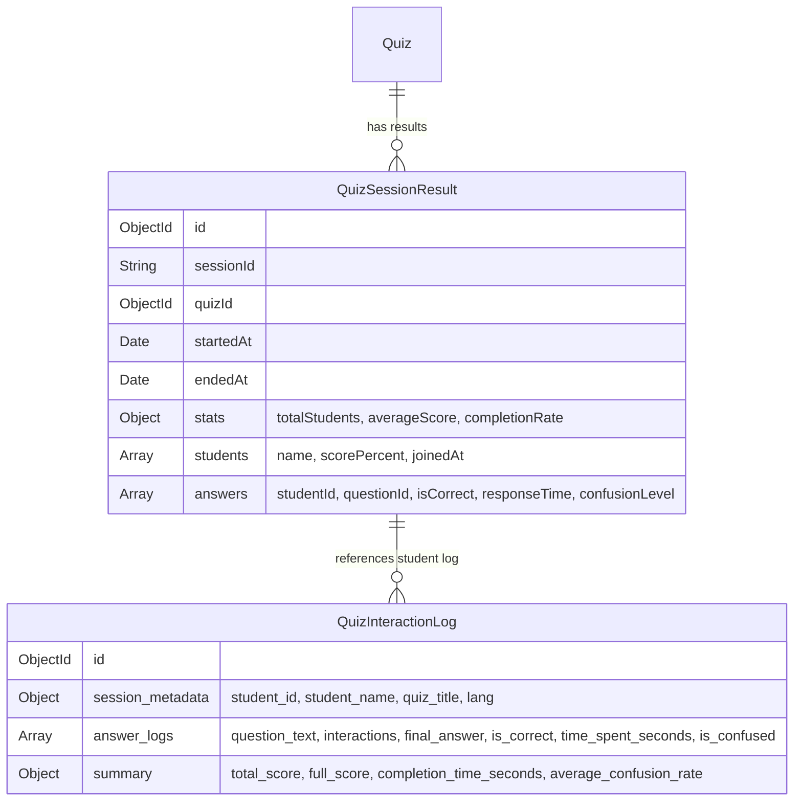

# 🤖 เอกสารรายละเอียดการเชื่อมต่อระบบ AI (AI System Integration Specification)

เอกสารฉบับนี้อธิบายรายละเอียดเกี่ยวกับสถาปัตยกรรม วิธีการเชื่อมต่อ รูปแบบการส่งข้อมูล (Payload) และกระบวนการจัดเก็บข้อมูลระหว่างส่วนหน้าบ้าน (**Frontend**), หลังบ้าน (**Backend / Next.js Server**) และ **Local Ollama LLM** สำหรับระบบวิเคราะห์การเรียนรู้อัจฉริยะ (AI-Powered E-Learning Analytics)

---

## 🛠️ 1. ภาพรวมการใช้งาน AI ในระบบ (AI Capabilities Overview)

ระบบมีการนำ AI (Local Ollama LLM) มาช่วยวิเคราะห์และสรุปผลข้อมูลใน 3 ส่วนหลัก ได้แก่:

1.  **AI Assistant with UI Inspection Mode (แชทบอทช่วยสอน):**
    *   อาจารย์สามารถเปิดแชทบอทคุยวิเคราะห์ข้อมูลหน้าเว็บทั่วไปได้
    *   **UI Inspection Mode:** อาจารย์ใช้เครื่องมือชี้เป้า 🎯 คลิกเลือกคอมโพเนนต์ใดก็ได้บนหน้าเว็บเพื่อแนบ "บริบทเฉพาะ (Context)" เช่น ข้อมูลนักเรียนหรือควิซ เข้าไปประมวลผลร่วมกับคำถามในแชทบอท
2.  **Personalized AI Quiz Recommendation (วิเคราะห์และแนะแนวรายบุคคล):**
    *   หลังจากนักเรียนสอบเสร็จ AI จะอ่านประวัติการสอบระดับวินาที (Interaction Telemetry Log) เพื่อชี้จุดอ่อน จุดแข็ง และแนะแนวทางเรียนรู้เฉพาะบุคคล
3.  **Session & Cross-Session Summary (วิเคราะห์ภาพรวมชั้นเรียนย้อนหลัง):**
    *   **Single Session Summary:** วิเคราะห์ข้อสอบที่ยากที่สุด ง่ายที่สุด สรุปผลสัมฤทธิ์ห้องเรียน และแนะนำแผนการเรียนการสอนในคาบถัดไป
    *   **Cross-Session Trend Analysis:** เปรียบเทียบผลลัพธ์ของควิซเดียวกันจากหลากหลายคาบเรียน/รุ่นเรียน เพื่อศึกษาพัฒนาการของหลักสูตร

---

## 📡 2. รูปแบบการส่งและรับข้อมูล (Data Flow & API Contracts)

การเชื่อมต่อ AI มีรูปแบบสถาปัตยกรรมการส่งข้อมูลผ่านตัวกลาง Next.js API Routes หรือ Express Backend เพื่อทำหน้าที่เป็น Proxy ดึงข้อมูลเพิ่ม เสริม Prompts และป้อนข้อมูลไปยัง Local Ollama ในเครื่อง มีรายละเอียดสัญญา API (API Specifications) ดังนี้:

### 2.1 ระบบแชท AI & UI Inspection Mode
*   **จุดเชื่อมต่อ (Endpoint):** `POST /api/chat` (Next.js API Route)
*   **พฤติกรรม:** Non-streaming (JSON response)
*   **โครงสร้างข้อมูลที่ Frontend ส่ง:**
    ```json
    {
      "messages": [
        { "role": "user", "content": "นักเรียนคนนี้มีปัญหาตรงไหน?" }
      ],
      "prompt": "ช่วยออกแบบโจทย์เพิ่มเติมให้ที",
      "context": {
        "studentId": "std_101",
        "name": "Protae",
        "scorePercent": 60,
        "detailedAnswers": [
          { "questionIndex": 1, "isCorrect": false, "confusion": "high", "timeSpent": 45 }
        ]
      },
      "lang": "th"
    }
    ```
*   **สิ่งที่ Server ส่งต่อไปยัง Ollama (`POST /api/chat`):**
    *   ประกอบ System Prompt ตามภาษาที่เลือก (`lang`) เพื่อบังคับภาษาการตอบ
    *   แนบ Context JSON เข้าไปเป็นข้อความบทบาท `system` เพื่อนำข้อมูลหลังบ้านของคอมโพเนนต์นั้นให้โมเดลประมวลผล
    ```json
    {
      "model": "qwen3:8b",
      "messages": [
        { "role": "system", "content": "You are a helpful teaching assistant... Respond in Thai language." },
        { "role": "system", "content": "Current page / element context: {\"studentId\":\"std_101\", ...}" },
        { "role": "user", "content": "ช่วยออกแบบโจทย์เพิ่มเติมให้ที" }
      ],
      "stream": false,
      "options": { "temperature": 0.7 }
    }
    ```

---

### 2.2 ระบบสรุปผลสอบและแนะแนวรายบุคคล (Personalized Recommendation)
*   **จุดเชื่อมต่อ (Endpoint):** `POST /api/analyze-quiz-log` (Next.js API Route)
*   **พฤติกรรม:** Non-streaming (JSON response)
*   **โครงสร้างข้อมูลที่ Frontend ส่ง:**
    *   หน้าบ้านสามารถเลือกส่ง `logId` (เพื่อให้หลังบ้านไปดึงไฟล์ Log เต็มจาก MongoDB) หรือส่งก้อนวัตถุ `log` โดยตรงก็ได้
    ```json
    {
      "logId": "665e8aef1f63004e0e227abc",
      "lang": "th"
    }
    ```
*   **สิ่งที่ Server ทำการแปลงข้อมูล (Prompt Construction):**
    หลังบ้านจะไปคัดแยกบันทึกข้อสอบ (Interaction Log) มาจัดเตรียมข้อความส่งให้ Ollama เพื่อเปลี่ยนข้อมูลตัวเลขระดับวินาทีเป็นบทสรุปคำพูดของครูผู้สอน:
    ```markdown
    Analyze the student performance:
    Student: Protae
    Quiz: Python Basic Variables
    Score: 1 / 3
    Confusion rate: 67% of questions (student hesitated)

    Per-question breakdown:
    Q1: "การประกาศตัวแปร" → ❌ Wrong (showed hesitation / changed answer) Time: 45s
    Q2: "Naming Rules" → ✅ Correct Time: 12s
    Q3: "Scope" → ❌ Wrong Time: 70s
    ```
*   **สิ่งที่ Server ส่งต่อไปยัง Ollama (`POST /api/chat`):**
    ```json
    {
      "model": "qwen3:8b",
      "messages": [
        { "role": "system", "content": "You are a helpful, empathetic learning coach..." },
        { "role": "user", "content": "...[Prompt ที่แปลงประวัตินักเรียนพร้อมคำแนะนำหัวข้อที่ต้องตอบ]..." }
      ],
      "stream": false
    }
    ```

---

### 2.3 ระบบสรุปวิเคราะห์วิทยฐานะห้องเรียน (Session History AI Streaming)
*   **จุดเชื่อมต่อ (Endpoint):** 
    *   **รายเซสชัน:** `POST /api/session-history/:sessionResultId/ai-summary`
    *   **รายนักเรียน:** `POST /api/session-history/:sessionResultId/ai-student/:studentId`
    *   **ข้ามเซสชัน:** `POST /api/session-history/quiz/:quizId/ai-cross-session`
*   **พฤติกรรม:** Streaming via **SSE (Server-Sent Events)** พิมพ์ข้อความทีละคำแบบสดๆ (Real-time token printing)
*   **ข้อมูลที่ Server ดึงและประมวลผล:**
    *   หลังบ้านจะดึงเอกสาร `QuizSessionResult` จาก MongoDB สรุปผลเปอร์เซ็นต์คะแนนเฉลี่ย ความยากง่ายของแต่ละข้อ และรายชื่อเด็ก
*   **สิ่งที่ Server ส่งต่อไปยัง Ollama (`POST /api/generate`):**
    *   ใช้ Endpoint `/api/generate` ในโหมด Stream เพื่อขอโทเคนทีละชิ้น
    ```json
    {
      "model": "qwen3:8b",
      "prompt": "Analyze the following quiz session results... (สถิติเฉลี่ยรายข้อและรายคน)",
      "stream": true
    }
    ```

---

## 💾 3. โครงสร้างและการจัดเก็บข้อมูล (Data Storage)

ข้อมูลทั้งหมดถูกจัดเก็บลงฐานข้อมูลถาวรใน **MongoDB** ก่อนส่งไปให้ AI ประมวลผลย้อนหลัง เพื่อไม่เป็นการเก็บสถานะ (Stateless) ไว้ที่เซิร์ฟเวอร์ และช่วยให้ AI ดึงข้อมูลย้อนหลังได้เสมอตลอด 24 ชม.



---

## 📊 4. แผนภาพกิจกรรมการส่งข้อมูล AI (AI Activity Diagram)

แผนภาพนี้แสดงโฟลว์กิจกรรมในการวิเคราะห์ข้อสอบรายบุคคลผ่านระบบ AI (Personalized Recommendation Flow) และการแชทบอทแนบบริบท (UI Inspection Chat Flow):

### 4.1 โฟลว์การวิเคราะห์ประวัติทำควิซรายบุคคล (Personalized Recommendation Flow)
```mermaid
autonumber
sequenceDiagram
    actor Student as ผู้เรียน (หน้าบ้าน)
    participant Front as Frontend (React App)
    participant NextRoute as Next.js API Route<br>(/api/analyze-quiz-log)
    participant Express as Express Backend
    participant DB as MongoDB
    participant Ollama as Local Ollama Server

    Student->>Front: คลิกปุ่ม "วิเคราะห์ด้วย AI" หลังสอบเสร็จ
    Front->>NextRoute: POST /api/analyze-quiz-log (แนบ logId, lang)
    critical ดึงและประมวลผลข้อมูลดิบ
        NextRoute->>Express: GET /api/quiz-logs/:logId
        Express->>DB: ค้นหาเอกสาร Interaction Log
        DB-->>Express: ส่งคืนข้อมูล Log
        Express-->>NextRoute: ส่งคืนข้อมูลพฤติกรรมการเล่นควิซระดับวินาที
    end
    NextRoute->>NextRoute: ประกอบ System Prompt และแปลงข้อมูลพฤติกรรมนักเรียนเป็น Text-prompt
    NextRoute->>Ollama: POST /api/chat (ส่ง qwen3:8b + prompt)
    Note over Ollama: ประมวลผลจุดอ่อน จุดแข็ง<br>และคำแนะนำสำหรับนักเรียน
    Ollama-->>NextRoute: ตอบกลับข้อความประเมิน (JSON Content)
    NextRoute-->>Front: คืนค่าผลลัพธ์คำแนะนำ { success: true, data }
    Front-->>Student: แสดงคำแนะนำแนะแนวการศึกษาในรูปแบบการ์ด Markdown สวยงาม
```

---

### 4.2 โฟลว์ระบบแชท AI ร่วมกับ UI Inspection Mode (AI Chatbot with UI Context)
```mermaid
autonumber
sequenceDiagram
    actor Teacher as อาจารย์ (ผู้สอน)
    participant Front as Frontend (Chat Widget)
    participant Hook as Target Picker Hook
    participant NextRoute as Next.js API Route<br>(/api/chat)
    participant Ollama as Local Ollama Server

    Teacher->>Front: เปิด Chat Widget และคลิกปุ่มเป้าหมาย 🎯 (Target Tool)
    Teacher->>Hook: เลื่อนเมาส์ชี้และคลิกเลือกการ์ดข้อมูลเด็กเรียนบนหน้าจอ
    Hook->>Front: ดึง Metadata ผ่านแอตทริบิวต์ data-ai-context-data
    Front-->>Teacher: แสดง Context Badge (ป้ายบริบทสีม่วง) เหนือช่องพิมพ์คำถาม
    Teacher->>Front: พิมพ์คำถาม "นักเรียนคนนี้มีปัญหาเรื่องใดและควรอธิบายอย่างไร?"
    Front->>NextRoute: POST /api/chat (แนบ messages, prompt, context, lang)
    NextRoute->>NextRoute: ประกอบ System Prompt ตามภาษาปัจจุบัน + แนบ Context เข้าไปใน Messages Array
    NextRoute->>Ollama: POST /api/chat (ส่ง qwen3:8b + Payload ทั้งหมด)
    Note over Ollama: อ่านบริบท Context แนบ<br>ประมวลผลควบคู่คำถามของครู
    Ollama-->>NextRoute: คืนข้อมูลข้อความวิเคราะห์
    NextRoute-->>Front: ส่งข้อมูลคำตอบ JSON { message, model }
    Front-->>Teacher: แสดงผลลัพธ์คำอธิบายภาษาไทยในหน้าต่างแชททันที
```

---
*จัดทำขึ้นสำหรับโปรเจกต์ E-Learning Platform - ส่วนงานวิเคราะห์ AI*  
*ปรับปรุงข้อมูลล่าสุด: 4 มิถุนายน 2026*
